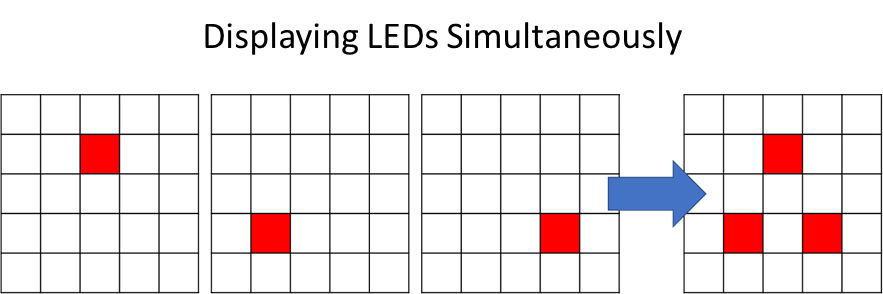
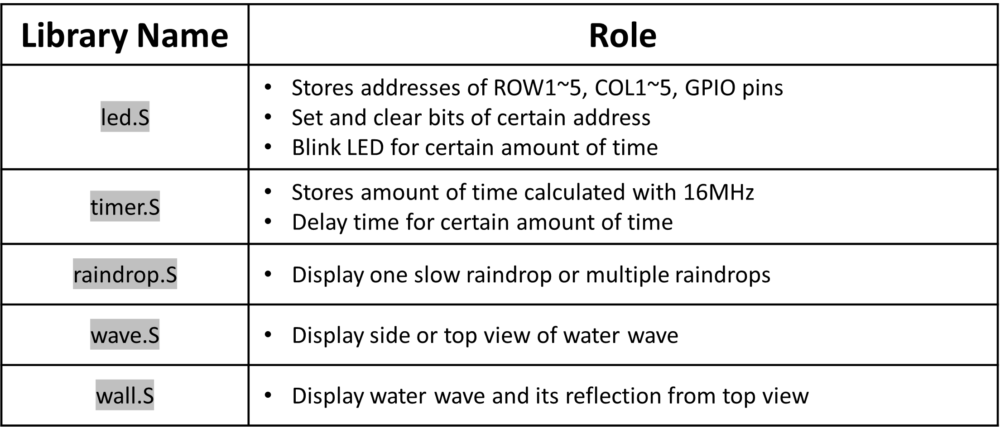
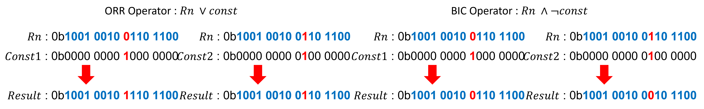
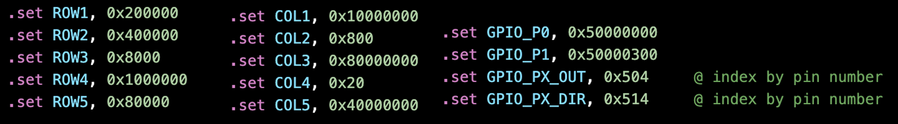

# What : Waterdrop, Wave and Reflection

The board uses LEDs to express water drop, wave and reflection of waves by the front wall. The show is divided into a total of five different stages as shown in the Figure.1 below.

Figure.1 Raindrops

Overall, the light show changes over time and engages a viewer for 40 seconds. The program works when the microbit is powered over USB and repeats the show forever. Each function in libraries uses memory to store data, so the show meets all the project specification.

# How : LED Light On and Off with ARM-v7 Assembly

Light blink function is made with several versions by the time delay. For example, the function to turn on LED for 500ms and turn off after the time delay. Time delay counts a loop of 500ms by using a timer that is set on <code>timer.S</code> library based on the knowledge that microbit uses 16MHz clock.

Light display of various patterns like the shape of a wave requires turning on multiple LEDs simultaneously. This was achieved by blinking particular sets of LEDs consecutively and repeated for a certain amount of time. This allows the viewer to see as if multiple LEDs are light simultaneously. Figure.2 is shown to help understanding simultaneous display.

Figure.2 LED Display

The data arrays of row and column number of pins are called to light on and off multiple LEDs.

# Why : Reasons for Design and Limitations

## Reasons for Design

The project contains custom libraries and they are all stored into the src folder. Each role of libraries is organized as in the Figure.3 below.

Figure.3 Role of Libraries

Libraries are used to improve code maintenance. It is very inefficient to have all necessary functions in the <code>main.S</code> file as too many lines of code would waste time on debugging codes. 
Also, it is easy to recognize which registers are used for functions within a certain library. This reduces the possibility that registers are mixed up when storing memory.

Functions are set global only if those are used in <code>main.S</code>. This makes sure the encapsulation of functions in the library and allows better code maintenance by showing only necessary functions to call.

Each library basically contains functions which use a load-twiddle-store pattern. It loads the address of a certain pin, executes a necessary calculation and stores the bit data into the address again. In this process, custom functions are created to execute load-twiddle-store patterns. 

All functions require which row and column number needed to be set where those are stored on register r4 and r5 each. In this way, I do not need to type in address of each row and column based on the pin address of microbit, which can be found in V2 pinmap of [this document](https://tech.microbit.org/hardware/schematic/#v2-pinmap). Only the calling function at <code>main.S</code> enables to set or clear bits in the pin. 

For the setting or clearing bits, we need to logically shift the 0b1 left side of numbers according to the pin address. And then ORR or BIC operators are used to set or clear bits of the original bits. How the ORR or BIC operator works is illustrated in Figure.4.

Figure.4 ORR, BIC Operator

Data arrays such as pin map address and time amount, are also included in each library. Pin map address data array is used to get the address of GPIO. The corresponding address of the pin can also be found in Figure.5. It allows reducing the amount of code lines by repeating the same function with different variables called from addresses.

Figure.5 Address of Pin

## Limitation

Repeating light

consultation notes
1. read this in detail
https://comp.anu.edu.au/courses/comp2300/resources/design-document/

2. focus more on "Implementation & Analysis" than "Design"

3. Diagram is not counted on words. Use them.

4. 
e.g. implementation : I used array to store data ..... 
e.g. analysis : stroing data is better for me than hard coding because .....