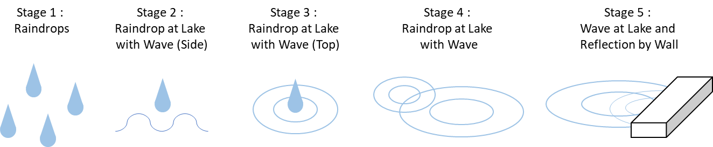

# What : Waterdrop, Wave and Reflection

The board uses LEDs to express water drop, wave and reflection of waves by the front wall. The show is divided into a total of five different stages as shown in Figure_1 below.

Figure_1. Raindrops

Overall, the light show changes over time and engages a viewer for 40 seconds. The program works when the microbit is powered over USB and repeats the show forever.

# How : LED Light On and Off with ARM-v7 Assembly

Light blink function is made with several versions by the time delay. The function turns on the LED for a certain amount of time and turns off after the time delay. Time delay counts a loop by using a timer that is set on <code>timer.S</code> library based on the knowledge that microbit uses 16MHz clock.

Light display of various patterns requires turning on LEDs simultaneously. The data arrays of row and column numbers are called to blink LEDs. This was achieved by blinking LEDs consecutively and repeated for a certain amount of loops. This allows the viewer to see as if multiple LEDs are lighted simultaneously. Figure_2 is shown to help understanding simultaneous display.

Figure_2. LED Display

# Why : Reasons for Design and Limitations

## Reasons for Design

The project contains custom libraries and they are all stored into the src folder. Each role of libraries is organized as in Figure_3 below.

Figure_3. Role of Libraries

Libraries are used to prevent all functions in the <code>main.S</code> file at once. It increases code maintenance by reducing code lines and making easy to recognize which registers are used for functions within a certain library. This reduces the possibility that registers are mixed up when storing memory.

Functions only used in <code>main.S</code> are set global. This makes sure the encapsulation of functions in the library and allows better code maintenance by showing only necessary functions to call.

Each library basically contains functions which use a load-twiddle-store pattern. It loads the address of a certain pin, executes a necessary calculation and stores the bit data into the address again.

Function allows to set or clear bits according to the address of each row and column based on the pin address of microbit, which can be found in the V2 pinmap of [this document](https://tech.microbit.org/hardware/schematic/#v2-pinmap). Only the calling function at <code>main.S</code> with row and column numbers enables setting or clearing bits in the pin.

Logical left shift was implemented to set or clear bits and ORR and BIC operators were implemented to compute final bits. How the ORR or BIC operator works is illustrated in Figure_4.

Figure_4. ORR, BIC Operator

Data arrays such as pin map address and time amount, are also included in each library. Pin map address data array is used to get the address of GPIO. The corresponding address of the pin can also be found in Figure_5. It allows reducing the amount of code lines by repeating the same function with different variables called from addresses.

Figure_5. Address of Pin

## Limitation

Timer used for blinking one LED or displaying multiple LEDs simultaneously is not parallel but in serial order. This means, displaying shape for 5ms is not exactly 5ms, but it counts loops for 80 (=0x50) times. It needs more study on using a microbit internal clock to store exact time to calculate accurate time in parallel order. Figure_6 shows how the program should be changed to use exact time.

Figure_6. Improvement by using internal clock

